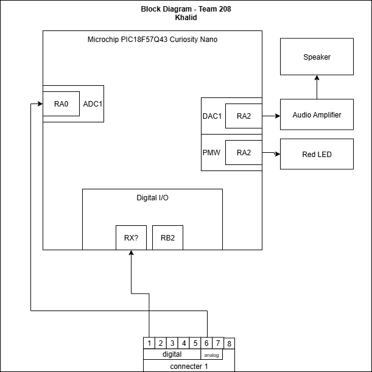

## Overview

The block diagram illustrates the overall functionality and connection between the key components of the Water Detection System. This part of the system focuses on the speaker alarm section, which provides an audio alert to the user when the sensors detect abnormal conditions such as water presence, high humidity, or pressure changes.
The audio amplifier boosts the signal from the microcontroller to drive the speaker, ensuring the alarm is loud and clear. A LED indicator also lights up as a visual alert when the alarm is active. The diagram highlights the team connections, showing how this subsystem interfaces with other parts developed by teammates, such as the sensor modules.
## Key
* Speaker – produces an audible alarm when triggered.
* Audio Amplifier – strengthens the output signal to drive the speaker.
* LED Indicator – provides visual feedback alongside the audio alert.
* Team Connections – represent how this subsystem links with sensor inputs managed by other team members.

## Example Block Diagram 

.

