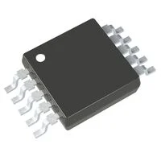

---
title: Component Selection Example
### Style 2

**Audio Amplifier Module**

1. NCP2809BDMR2G surface mount Integrated Circuits (ICs)

    

    * $1/each
    * [link to product](https://www.digikey.com/short/07j43d31)

    | Pros                                      | Cons                                                             |
    | ----------------------------------------- | ---------------------------------------------------------------- |
    | Low power consumption suitable for battery| Limited output power for large speakers                          |
    | clean audio alerts                        | Requires external capacitors for optimal performance             |
    | Small footprint fits compact PCB designs  | 

1. TPA4411RTJR surface mount Integrated Circuits (ICs)
   
    

    * $1/each
    * [Link to product](https://www.digikey.com/short/p25b5w03)

    | Pros                                                              | Cons                |
    | ----------------------------------------------------------------- | ------------------- |
    | clear mono audio output with low distortion                       | More expensive      |
    | Built-in shutdown mode to save power when idle                    | Requires PCB layout for noise reduction|
    | small speaker in water detection system                           | 

**Choice:** Option 1: NCP2809BDMR2G surface mount Integrated Circuits (ICs)

**Rationale:** The NCP2809BDMR2G is a low-power stereo audio amplifier we use in the water detector to boost the alert sound from a sensor signal, ensuring a clear and audible warning when water is detected and can save up power ensuring it will keep up the alarm until someone comes.
