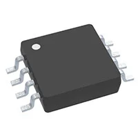
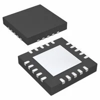

---
title: Component Selection Example

**Speaker**

1.  SP-1504
   
    

    * $2/each
    * [Link to product](https://www.digikey.com/short/f19wq4nn)

    | Pros                                                              | Cons                |
    | ----------------------------------------------------------------- | ------------------- |
    |    Compact size fits small                            |  Lower sound output              |
    |    Low power and compatible with small amplifiers     |  Limited frequency               |
    |    Suitable for basic alert tones                     |  Not ideal for loud environments |

2.  SP-3605
   
    

    * $3/each
    * [Link to product](https://www.digikey.com/short/3mwtr4zn)

    | Pros                                                              | Cons                |
    | ----------------------------------------------------------------- | ------------------- |
    |     Louder sound output, ideal for alerts                |     Slightly larger size       |
    |     Wider frequency response for clearer audio           |     Higher power consumption   |
    |     Durable and reliable for long-term use               | 

**Choice:** Option 1: SP-1504 

**Rationale:** The SP-1504 was chosen because it meets the project’s need for a compact, low-power speaker that can clearly produce alert sounds when water is detected. Its small form factor makes it easy to integrate into the enclosure, and it works efficiently with the chosen amplifier (NCP2809BDMR2G) without requiring additional power circuitry.

**Audio Amplifier Module**

1. LM4810MMX/NOPB surface mount Integrated Circuits (ICs)

    

    * $1/each
    * [link to product](https://www.digikey.com/short/07j43d31)

    | Pros                                      | Cons                                                             |
    | ----------------------------------------- | ---------------------------------------------------------------- |
    | Low power consumption suitable for battery| Limited output power for large speakers                          |
    | clean audio alerts                        | Requires external capacitors for optimal performance             |
    | Small footprint fits compact PCB designs  | 

2. TPA4411RTJR surface mount Integrated Circuits (ICs)
   
    

    * $1/each
    * [Link to product](https://www.digikey.com/short/p25b5w03)

    | Pros                                                              | Cons                |
    | ----------------------------------------------------------------- | ------------------- |
    | clear mono audio output with low distortion                       | More expensive      |
    | Built-in shutdown mode to save power when idle                    | Requires PCB layout for noise reduction|
    | small speaker in water detection system                           | 

**Choice:** Option 1: LM4810MMX/NOPB surface mount Integrated Circuits (ICs)

**Rationale:** The LM4810MMX/NOPB is a low-power stereo audio amplifier we use in the water detector to boost the alert sound from a sensor signal, ensuring a clear and audible warning when water is detected and can save up power ensuring it will keep up the alarm until someone comes.
