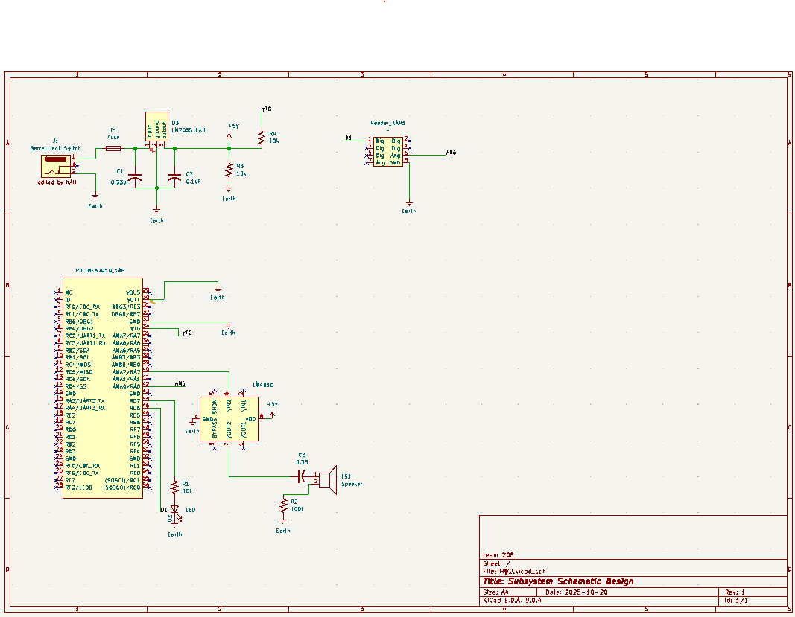

## Overview

This schematic is design to support .... (highlight functionally, power, and controller).

This schematic is designed to support the audio alert section of the Water Detection System. It integrates power regulation, signal amplification, and visual indication using a PIC18F57Q10 microcontroller, LM4810 audio amplifier, and a 5V regulated power supply.
The schematic ensures that the system operates reliably by providing stable +5V power and clean audio output through the speaker. The microcontroller processes signals from the sensors (water, pressure, humidity) and activates the audio amplifier and LED indicator when thresholds are exceeded.

{style width:"350" height:"300;"}
**Figure ##:** Showing a example schematic.

## Resouces

The schematic as a PDF download is available [*here*](newSCH.png), and the Zip folder of the project [*here*](SCH.zip).
