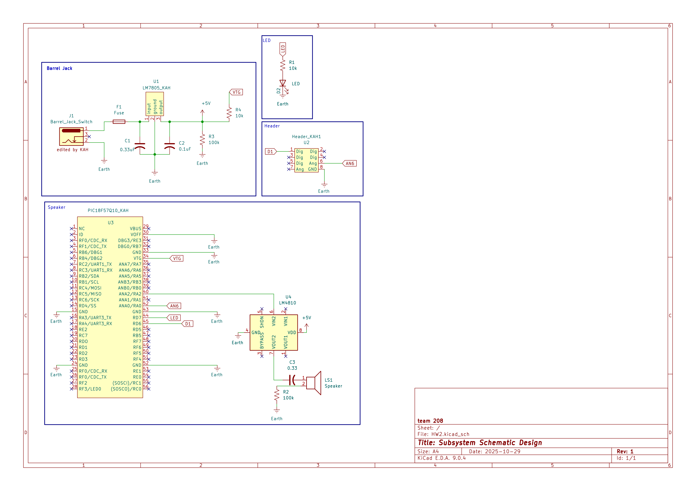

## Overview

This schematic is designed to support the audio alert section of the Water Detection System. It integrates power regulation, signal amplification, and visual indication using a PIC18F57Q10 microcontroller, LM4810 audio amplifier, and a 5V regulated power supply.
The schematic ensures that the system operates reliably by providing stable +5V power and clean audio output through the speaker. The microcontroller processes signals from the sensors (water, pressure, humidity) and activates the audio amplifier and LED indicator when thresholds are exceeded.

**Figure 1:** latest Schematic

## Resouces

The schematic as a PDF download is available [*here*](schematic.png), and the Zip folder of the project [*here*](SCH.zip).
