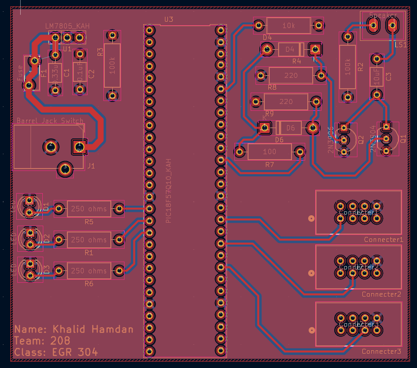

### PCB
## Overview
I designed a blueprint and printed a PCB for my speaker project. It came out pretty well, but there was a mistake in the measurements, so it didn’t fit correctly. Because of that, I ended up using a breadboard instead. 

**Figure 1:** PCB.

**Figure 2:** PCB printed.

## Resouce for PCB

The PCB as a PDF download is available [*here*](), and the Zip folder of the project [*here*](PCB.zip).
