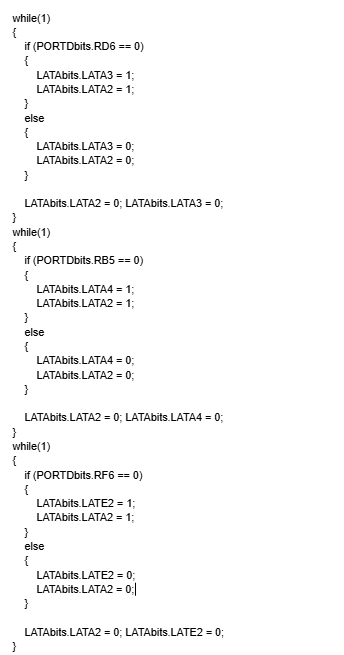

# Code Testing
We started by just testing the lights and making sure they worked along the speaker. We made each light turn on one at a time for the given seconds in a repeating cycle. This proved the hardware was connected correctly.

# Final Code
In the final code the system constantly checks all three sensors at the same time. The code now properly:
* Watches for water leaks and turns on a LED1 light with the speaker
* Watches for humidity problems and turns on a LED2 light with the speaker
* Watches for pressure issues and turns on a LED3 light with the speaker
* Alerts the speaker on as long as ANY sensor has a problem
* Turns everything off when all sensors are back to normal

.

**Figure 1:** 

.
.

**Figure 2:** 
